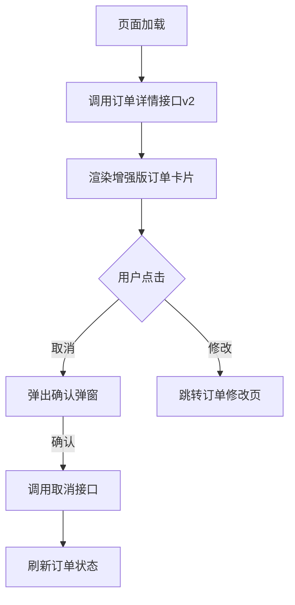
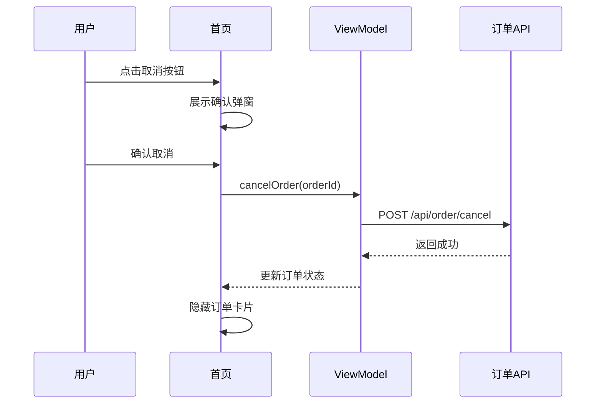

# 技术方案文档转换示例

本文档提供完整的转换示例，帮助理解如何将 Workflow 文档转换为公司评审标准的技术方案文档。

## 示例场景

**需求名称**：首页订单卡片优化

**需求背景**：优化首页进行中订单的展示和操作能力，提升用户体验。

---

## 输入1：需求分析文档

**文件路径**：`AICodingDoc/首页订单卡片优化需求/首页订单卡片优化需求分析.md`

```markdown
# 首页订单卡片优化需求分析

## 需求理解

**产品需求**：优化首页进行中订单的展示和操作能力

**需求链接**：https://prd.example.com/doc/12345

**核心诉求**：
1. 当前版本的进行中订单模块过于简单，用户无法直接进行取消、修改等操作
2. 需要将订单卡片移至更合理的位置，增强功能性
3. 需要展示更丰富的订单信息

## 业务名词

- **进行中订单**：用户已下单但未完成（未取消/未完成行程）的订单
- **订单卡片**：首页展示订单信息的UI组件

## 改动点分析

### 改动点1：首页订单卡片UI重构

- **改动位置**：HomeFragment、home_layout.xml
- **改动类型**：修改
- **改动原因**：提升用户操作便捷性，当前版本功能过于简单
- **改动点核心逻辑**：
  - 将顶部的进行中订单模块从起点输入框上方移除
  - 在输入框下方新增一个更丰富的进行中订单卡片
  - 卡片包含：订单状态、订单详情、取消按钮、修改按钮等操作入口

### 改动点2：订单数据获取接口升级

- **改动位置**：OrderRepository、OrderApi
- **改动类型**：修改
- **改动原因**：需要获取更丰富的订单数据以支持新UI展示
- **改动点核心逻辑**：
  - 调用新接口 `/api/order/detail/v2` 替换原有的 `/api/order/simple` 接口
  - 新接口返回订单状态、起终点、预计费用、司机信息等详细数据

### 改动点3：订单操作能力增强

- **改动位置**：OrderActionHandler
- **改动类型**：新增
- **改动原因**：支持用户直接在首页进行订单操作
- **改动点核心逻辑**：
  - 新增订单取消功能：调用取消接口，展示确认弹窗
  - 新增订单修改功能：跳转到订单修改页面，支持修改目的地、时间等
```

---

## 输入2：技术方案文档

**文件路径**：`AICodingDoc/首页订单卡片优化需求/首页订单卡片优化需求技术方案.md`

```markdown
# 首页订单卡片优化技术方案

## 详细设计

### 改动点1：首页订单卡片UI重构

#### 现状逻辑

**第一步：页面初始化**
1. HomeFragment 在 `onViewCreated` 中初始化订单卡片
2. 订单卡片位于起点输入框上方（`top_order_card` 组件）
3. 卡片只展示订单号和状态文字，无操作按钮
4. 布局文件：`home_layout.xml`

**第二步：数据获取**
1. 调用 `OrderRepository.getSimpleOrder()` 获取订单数据
2. 接口：`/api/order/simple`
3. 返回字段：`orderId`, `status`
4. 数据通过 LiveData 通知UI更新

**第三步：UI渲染**
1. 根据订单状态显示不同文字颜色
2. 点击卡片跳转订单详情页

#### 改动方案

**UI调整**
1. 调整布局文件 `home_layout.xml`：
   - 移除 `top_order_card` 组件
   - 在输入框下方新增 `order_card_enhanced` 组件
2. 新卡片包含：
   - 订单状态标签（待接单/已接单/进行中）
   - 起终点信息
   - 预计费用
   - 操作按钮组：取消订单、修改订单

**数据层调整**
1. 新增接口调用：`OrderApi.getOrderDetailV2()`
2. 接口路径：`/api/order/detail/v2`
3. 返回字段：
   ```json
   {
     "orderId": "123456",
     "status": "WAITING_ACCEPT",
     "origin": "中关村软件园",
     "destination": "望京SOHO",
     "estimatedFee": "28.5",
     "driverInfo": {...}
   }
   ```

**业务逻辑调整**
1. 在 HomeFragment 中新增订单操作处理逻辑
2. 取消订单：弹出确认弹窗 → 调用取消接口 → 刷新UI
3. 修改订单：跳转到 `OrderModifyActivity`，传递订单ID

#### 实现流程图



#### 代码示例

```kotlin
// HomeFragment.kt
private fun setupOrderCard() {
    viewModel.orderDetail.observe(viewLifecycleOwner) { order ->
        binding.orderCardEnhanced.apply {
            tvOrderStatus.text = order.statusText
            tvOrigin.text = order.origin
            tvDestination.text = order.destination
            tvFee.text = "¥${order.estimatedFee}"
            
            btnCancel.setOnClickListener {
                showCancelConfirmDialog(order.orderId)
            }
            
            btnModify.setOnClickListener {
                OrderModifyActivity.start(requireContext(), order.orderId)
            }
        }
    }
}

private fun showCancelConfirmDialog(orderId: String) {
    AlertDialog.Builder(requireContext())
        .setTitle("确认取消订单")
        .setMessage("取消后将无法恢复，是否继续？")
        .setPositiveButton("确认") { _, _ ->
            viewModel.cancelOrder(orderId)
        }
        .setNegativeButton("我再想想", null)
        .show()
}
```

### 改动点2：订单数据获取接口升级

#### 现状逻辑

1. 使用 `OrderRepository.getSimpleOrder()` 获取简单订单数据
2. 接口：`GET /api/order/simple`
3. 返回字段少，只包含订单ID和状态

#### 改动方案

1. 新增方法：`OrderRepository.getOrderDetailV2()`
2. 调用新接口：`GET /api/order/detail/v2`
3. 返回完整订单数据，支持新UI展示需求
4. 保持现有的 `getSimpleOrder()` 方法不变，其他模块继续使用

#### 接口定义

```kotlin
// OrderApi.kt
interface OrderApi {
    @GET("/api/order/detail/v2")
    suspend fun getOrderDetailV2(): Response<OrderDetailV2>
}

// OrderDetailV2.kt
data class OrderDetailV2(
    val orderId: String,
    val status: String,
    val statusText: String,
    val origin: String,
    val destination: String,
    val estimatedFee: String,
    val driverInfo: DriverInfo?
)
```

### 改动点3：订单操作能力增强

#### 现状逻辑

首页订单卡片不支持任何操作，用户需要：
1. 点击卡片进入订单详情页
2. 在详情页才能进行取消、修改等操作
3. 操作路径较长，体验不佳

#### 改动方案

在首页直接支持订单操作：

**取消订单流程**
1. 用户点击"取消订单"按钮
2. 弹出二次确认弹窗（防止误操作）
3. 用户确认后调用取消接口：`POST /api/order/cancel`
4. 接口成功后刷新订单状态，卡片消失
5. 接口失败展示错误提示

**修改订单流程**
1. 用户点击"修改订单"按钮
2. 跳转到 `OrderModifyActivity`，传递订单ID
3. 用户在修改页面完成修改后返回
4. 返回首页时自动刷新订单数据

#### 流程图



## 技术栈说明

- **架构**：MVVM
- **UI框架**：Android View + ViewBinding
- **网络层**：Retrofit + Coroutines
- **数据流**：LiveData
```

---

## 输出：转换后的技术方案文档

**文件路径**：`AICodingDoc/首页订单卡片优化需求/首页订单卡片优化需求-评审版技术方案.md`

```markdown
# 修订版本

v1.0

---

# 人员邀请及阅读打卡

| 角色 | 姓名 | 阅读状态 |
|------|------|----------|
| 产品经理 |  |  |
| 测试负责人 |  |  |
| 架构师 |  |  |
| 开发负责人 |  |  |

---

# 需求文档

产品PRD链接：https://prd.example.com/doc/12345

---

# 需求分析

## 名词解释

- **进行中订单**：用户已下单但未完成（未取消/未完成行程）的订单
- **订单卡片**：首页展示订单信息的UI组件

## 用例分析

本需求无复杂业务场景，不需要用例分析。

## 改动点分析

| 改动项 | 改动分类 | 改动类型 | 改动说明 |
|--------|----------|----------|----------|
| 首页订单卡片展示优化 | 用户交互 | 修改 | 将顶部简单订单卡片移至输入框下方，增加订单状态、起终点、预计费用等详细信息展示，并提供取消、修改等快捷操作入口，提升用户操作便捷性和信息可见性 |
| 订单数据获取能力增强 | 接口变更 | 修改 | 升级订单数据接口从v1到v2，获取更丰富的订单详细信息（起终点、费用、司机信息等），支持首页卡片的完整信息展示需求 |
| 订单快捷操作能力 | 业务流程 | 新增 | 新增首页直接取消和修改订单的能力，用户无需跳转到详情页即可完成操作，缩短操作路径，提升用户体验 |

---

# 变更披露

## 数据变化

待补充

## API变化

**新增接口**：
- `GET /api/order/detail/v2`：获取订单详细信息（v2版本）

**使用接口**：
- `POST /api/order/cancel`：取消订单

**废弃接口**：
- 无（`/api/order/simple` 保留，其他模块继续使用）

---

# 技术设计与实现

## 架构设计

本需求为功能优化，无架构变更。

## 详细设计

### 改动点1：首页订单卡片UI重构

#### 现状逻辑

**第一步：页面初始化**
1. HomeFragment 在 `onViewCreated` 中初始化订单卡片
2. 订单卡片位于起点输入框上方（`top_order_card` 组件）
3. 卡片只展示订单号和状态文字，无操作按钮
4. 布局文件：`home_layout.xml`

**第二步：数据获取**
1. 调用 `OrderRepository.getSimpleOrder()` 获取订单数据
2. 接口：`/api/order/simple`
3. 返回字段：`orderId`, `status`
4. 数据通过 LiveData 通知UI更新

**第三步：UI渲染**
1. 根据订单状态显示不同文字颜色
2. 点击卡片跳转订单详情页

#### 改动方案

**UI调整**
1. 调整布局文件 `home_layout.xml`：
   - 移除 `top_order_card` 组件
   - 在输入框下方新增 `order_card_enhanced` 组件
2. 新卡片包含：
   - 订单状态标签（待接单/已接单/进行中）
   - 起终点信息
   - 预计费用
   - 操作按钮组：取消订单、修改订单

**数据层调整**
1. 新增接口调用：`OrderApi.getOrderDetailV2()`
2. 接口路径：`/api/order/detail/v2`
3. 返回字段：
   ```json
   {
     "orderId": "123456",
     "status": "WAITING_ACCEPT",
     "origin": "中关村软件园",
     "destination": "望京SOHO",
     "estimatedFee": "28.5",
     "driverInfo": {...}
   }
   ```

**业务逻辑调整**
1. 在 HomeFragment 中新增订单操作处理逻辑
2. 取消订单：弹出确认弹窗 → 调用取消接口 → 刷新UI
3. 修改订单：跳转到 `OrderModifyActivity`，传递订单ID

#### 实现流程图


#### 代码示例

```kotlin
// HomeFragment.kt
private fun setupOrderCard() {
    viewModel.orderDetail.observe(viewLifecycleOwner) { order ->
        binding.orderCardEnhanced.apply {
            tvOrderStatus.text = order.statusText
            tvOrigin.text = order.origin
            tvDestination.text = order.destination
            tvFee.text = "¥${order.estimatedFee}"
            
            btnCancel.setOnClickListener {
                showCancelConfirmDialog(order.orderId)
            }
            
            btnModify.setOnClickListener {
                OrderModifyActivity.start(requireContext(), order.orderId)
            }
        }
    }
}

private fun showCancelConfirmDialog(orderId: String) {
    AlertDialog.Builder(requireContext())
        .setTitle("确认取消订单")
        .setMessage("取消后将无法恢复，是否继续？")
        .setPositiveButton("确认") { _, _ ->
            viewModel.cancelOrder(orderId)
        }
        .setNegativeButton("我再想想", null)
        .show()
}
```

### 改动点2：订单数据获取接口升级

#### 现状逻辑

1. 使用 `OrderRepository.getSimpleOrder()` 获取简单订单数据
2. 接口：`GET /api/order/simple`
3. 返回字段少，只包含订单ID和状态

#### 改动方案

1. 新增方法：`OrderRepository.getOrderDetailV2()`
2. 调用新接口：`GET /api/order/detail/v2`
3. 返回完整订单数据，支持新UI展示需求
4. 保持现有的 `getSimpleOrder()` 方法不变，其他模块继续使用

#### 接口定义

```kotlin
// OrderApi.kt
interface OrderApi {
    @GET("/api/order/detail/v2")
    suspend fun getOrderDetailV2(): Response<OrderDetailV2>
}

// OrderDetailV2.kt
data class OrderDetailV2(
    val orderId: String,
    val status: String,
    val statusText: String,
    val origin: String,
    val destination: String,
    val estimatedFee: String,
    val driverInfo: DriverInfo?
)
```

### 改动点3：订单操作能力增强

#### 现状逻辑

首页订单卡片不支持任何操作，用户需要：
1. 点击卡片进入订单详情页
2. 在详情页才能进行取消、修改等操作
3. 操作路径较长，体验不佳

#### 改动方案

在首页直接支持订单操作：

**取消订单流程**
1. 用户点击"取消订单"按钮
2. 弹出二次确认弹窗（防止误操作）
3. 用户确认后调用取消接口：`POST /api/order/cancel`
4. 接口成功后刷新订单状态，卡片消失
5. 接口失败展示错误提示

**修改订单流程**
1. 用户点击"修改订单"按钮
2. 跳转到 `OrderModifyActivity`，传递订单ID
3. 用户在修改页面完成修改后返回
4. 返回首页时自动刷新订单数据

#### 流程图


## 技术栈说明

- **架构**：MVVM
- **UI框架**：Android View + ViewBinding
- **网络层**：Retrofit + Coroutines
- **数据流**：LiveData

---

# 技术风险

## 灰度方案

待补充

## 观测方案

待补充

## 应急方案

待补充

---

# 成本评估

无

---

# 技术方案评审记录

| 评审时间 | 评审人 | 评审意见 | 处理状态 |
|---------|--------|----------|----------|
|  |  |  |  |
```

---

## 转换要点总结

### 改动点分析转换对比

**原始需求分析（技术视角）**：
- 改动点1：HomeFragment、home_layout.xml 修改
- 改动点2：OrderRepository、OrderApi 修改
- 改动点3：OrderActionHandler 新增

**转换后（产品视角）**：
- 改动项1：首页订单卡片展示优化（用户交互）
- 改动项2：订单数据获取能力增强（接口变更）
- 改动项3：订单快捷操作能力（业务流程）

### 关键改进点

1. **从技术术语转为业务语言**
   - 技术：HomeFragment、home_layout.xml
   - 业务：首页订单卡片展示

2. **从实现细节转为业务价值**
   - 技术：调整布局文件，移除旧组件，新增新组件
   - 业务：增加订单详细信息展示，提供快捷操作入口，提升用户操作便捷性

3. **按功能聚合而非按文件拆分**
   - UI改动 + 数据改动 + 逻辑改动 → 聚合为"首页订单卡片展示优化"

4. **突出业务价值**
   - 每个改动说明都包含"为什么改"和"带来什么效果"
